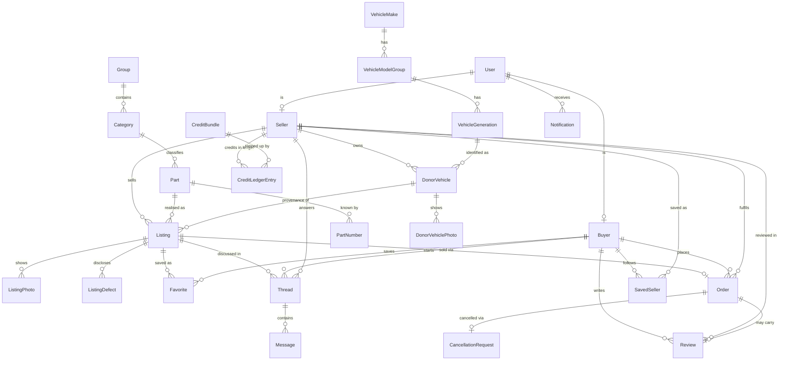

# v1 Domain Model — entities & relationships

Resolves [Core domain model — entities & relationships (#2)](https://github.com/Lucy-yunn/carparts/issues/2)
on the [Wayfinder map (#1)](https://github.com/Lucy-yunn/carparts/issues/1).

This is the entity-relationship skeleton the remaining tickets build on. It defines *what the
entities are, what they hold at a conceptual level, and how they relate* — not table DDL,
column types, or lifecycle detail. Those belong to the downstream tickets listed at the end.

Vocabulary is governed by [`CONTEXT.md`](../CONTEXT.md). Field lists here are conceptual;
where a ticket owns the full detail it is named inline.

> **Revised 2026-09-19.** The founders' v1 scope change amended this model: the order lifecycle
> (`placed → confirmed → completed`, plus `cancelled` and `refused`; no shipping) is now operated
> by the seller ([ADR-0009](./adr/0009-seller-operated-orders-cash-on-delivery.md)); new entities
> `Review`, `SavedSeller`, `CreditBundle` and `CreditLedgerEntry`; new fields on `Buyer`, `Seller`
> and `DonorVehicle`. Sections below are updated; the ticket-history tables at the end are
> historical.

---

## The four questions this ticket had to settle

### 1. Is Provenance its own entity or embedded fields on the Listing?

**Neither — Provenance is a relationship.** A **`DonorVehicle`** is a first-class entity: the
physical car a Seller dismantled. A **`Listing`** points at exactly one `DonorVehicle`
(`Listing.donorVehicleId`, required), and many Listings share one `DonorVehicle`. *Provenance*
is that `Listing → DonorVehicle` link. Anything specific to how this one part came off the car
(e.g. "removed with mounting bracket") is a nullable `removalNotes` field on the Listing.

Why not embedded fields (as the map's Q6 and this ticket originally framed it): staff intake
is donor-first — enter the car once, then add its parts — and dismantlers list dozens of parts
per car. Embedding would re-type VIN / mileage / engine code on every Listing.

### 2. How does the catalogue relate a Listing to a vehicle?

**One path only: Provenance.** The vehicle catalogue is `VehicleMake → VehicleModelGroup →
VehicleGeneration`, and a `Listing` reaches its vehicle through
`Listing → DonorVehicle → VehicleGeneration` (`DonorVehicle.generationId` is **required** — see
[Listing model (#8)](https://github.com/Lucy-yunn/carparts/issues/8); there is no unknown-donor
case, staff always identify the donor to a Generation, extending the hand-built catalogue
during intake when needed).

There is **no `Fitment` entity in v1** — no platform-verified `Part ↔ vehicle` compatibility
assertion. The two-person team does not research, assert, or maintain which other vehicles each
part fits. Buyer discovery is **provenance-based**: a Listing surfaces for a buyer's chosen
Generation when its donor vehicle is that Generation. This is discovery evidence, not a
compatibility guarantee — same-generation provenance does **not** mean the part is
interchangeable; buyers check the part number and the donor vehicle's structured details
(engine, engine code, gearbox, drivetrain — all shown on the Listing) before purchasing.
Cross-vehicle compatibility is deferred (see the map's *Out of scope*); amended by
[#21](https://github.com/Lucy-yunn/carparts/issues/21).

### 3. Is User one entity with a role, or separate Buyer / Seller / Staff entities?

**Hybrid.**

- **`User`** — the single login identity for everyone, carrying `role`
  (`buyer` | `seller` | `staff`), exactly one per User in v1. Owned by Better Auth.
- **`Buyer`** — a profile entity, 1:1 with a `User`, **auto-created on self-registration**.
  Holds delivery address and contact details.
- **`Seller`** — a profile entity, **created by staff during onboarding**; its `User` link is
  1:1 and is attached when a seller login is provisioned. The link may be unset only briefly,
  between profile creation and provisioning: **a seller cannot publish or sell without an active
  login** ([`auth-and-permissions.md`](./auth-and-permissions.md) §4.4). Holds business / display
  name, contact, avatar, and the single embedded Location.
- **Staff** — no profile entity; just `User.role = staff` (only the two founders, created by
  hand).

Sale-related entities (`Order`, `Favorite`, `Thread`, `Listing`, `DonorVehicle`) reference
`Buyer` / `Seller`, not `User`.

### 4. Where does the Category → Part → Listing hierarchy enforce its invariants?

- **Structural invariants → the Prisma schema / database.** "A Listing has a Part", "a Part
  has a Category", "a Part attaches only to a leaf" — the last is automatic because `Group`
  and `Category` are separate tables, so a `Part.categoryId` structurally *cannot* point at a
  `Group`. Enforced by FKs, required relations, and enums.
- **Behavioural invariants → the DAL service layer**, next to Better Auth authorization:
  `partStatus` transitions (`provisional → confirmed`, staff-only, no going back), intake
  de-duplication, staff merges, "cannot delete a Category that still has Parts", and
  `Listing.sellerId == DonorVehicle.sellerId`.
- **No** database triggers or check constraints beyond FK / enum / unique in v1.

---

## Entity catalogue

### People & access

#### User
The login identity for every person who can sign in. Owned by Better Auth.

- `email`, `passwordHash` (Better Auth), `name`
- `role` — `buyer` | `seller` | `staff`; exactly one in v1
- `messagingBlockedAt` — nullable; set by staff to bar this User from all messaging (see
  [`docs/messaging-model.md`](./messaging-model.md))
- Relationships: 1:1 optional → `Buyer`; 1:1 optional → `Seller`. A `staff` User has neither.

Permission matrix and session detail: [Auth, roles & permissions (#12)](https://github.com/Lucy-yunn/carparts/issues/12).

#### Buyer
A party who browses and purchases. Created automatically when a person self-registers.

- `userId` — 1:1, required
- **saved delivery address** — `recipientName`, `phone`, `addressLine1`, `addressLine2?`,
  `city`, `postcode`, `country`; editable in buyer settings, snapshotted onto each `Order` at
  checkout (see [`docs/order-model.md`](./order-model.md))
- `deliveryCity` — nullable; the city the buyer confirmed in the header's **Delivery to**
  control, pre-filling checkout ([`buyer-funnel-search.md`](./buyer-funnel-search.md) §6)
- Relationships: → many `Order`, → many `Favorite`, → many `SavedSeller`, → many `Thread`,
  → many `Review`

#### Seller
A party whose parts are sold on the platform. Created by staff during onboarding.

- `userId` — 1:1, attached when a login is provisioned (required before publishing)
- `displayName` (the business name shown to buyers), contact name / email / phone. **`contactPhone`
  is shown publicly to signed-in users only**; email and contact name are staff-facing.
- `avatarUrl` — nullable, uploaded by staff
- `lastActiveAt` — nullable; set on the seller's sign-in or action, at most once per day
- **Location** (embedded): name, address line, city, postcode, country — one per Seller in v1
- Derived, not stored: rating average and count ([`reviews.md`](./reviews.md)), credit balance
  ([`seller-credits.md`](./seller-credits.md)), "on IVO since" (earliest `publishedAt`)
- Relationships: → many `DonorVehicle`, → many `Listing`, → many `Order` (as seller),
  → many `Thread` (as seller), → many `Review`, → many `SavedSeller`, → many `CreditLedgerEntry`

Seller-center scope: [`seller-center.md`](./seller-center.md). Public profile:
[`seller-profile.md`](./seller-profile.md).

### Catalogue

#### Group
A display-only cluster of Categories — the funnel's final-step headings. ~13 rows, frozen.

- `name`, `slug` (immutable), `displayOrder`
- Relationships: → many `Category`. **Never referenced by `Part`.**

#### Category
A selectable leaf part type. Plus one "Other / not listed" catch-all.

- `groupId` — required
- `name` (en-GB, sentence case, singular, no side/brand/vehicle), `slug` (immutable kebab-case)
- `synonyms[]` — captured from day one
- `tecdocGenericArticleIds[]` — nullable, reserved for a later parts-catalogue integration
- `displayOrder`, `isActive`
- Relationships: → many `Part`

Exact leaf list is finalised with the seed-data plan (see map). Full taxonomy rules:
[v1 category taxonomy (#3)](https://github.com/Lucy-yunn/carparts/issues/3).

#### Part
The platform's canonical technical identity of a component. One Part, many Listings.

- `id` — opaque surrogate; **never** an OEM part number
- `internalCode` — readable staff code, e.g. `PRT-000123`, unique
- `categoryId` — required (always a leaf)
- `name` — staff-authored label
- `attributes` — validated JSONB, keyed by Category, with a per-Category Zod schema;
  a high-value attribute can be promoted to an indexed column later
- `partStatus` — `provisional` (created at intake) | `confirmed` (staff-verified)
- `pnStatus` — `unknown` | `unverified` | `verified` (summary of its PartNumbers)
- `notes`, `createdBy`
- Relationships: → many `PartNumber`, → many `Listing`

Merge semantics, de-dup workflow, supersession (deferred):
[Part identity & OEM part-number model (#5)](https://github.com/Lucy-yunn/carparts/issues/5).

#### PartNumber
One number a Part is known by. A Part has 0..n; zero is valid.

- `partId` — required
- `raw`, `normalized` (separators stripped, indexed — the match key)
- `numberType` — `oem` | `aftermarket` | `casting` | `trade` | `other`
- `brand` — free-form string, nullable, **not** an FK
- `isPrimary` — at most one true per Part
- `verified` — staff physically read it or confirmed it in a catalogue
- `note`, `createdBy`

Cross-brand numbers join the same Part **only after staff verify interchangeability**.

### Vehicles

Hand-built catalogue; only Generations matching pilot sellers' real donor vehicles. Stored
as a repo seed fixture; admin CRUD deferred. Detail:
[Vehicle reference data strategy (#4)](https://github.com/Lucy-yunn/carparts/issues/4). Grain and
the grouped `VehicleModelGroup` level: [#21](https://github.com/Lucy-yunn/carparts/issues/21).

#### VehicleMake
- `name`, `slug`, `country` (nullable, display), `displayOrder`, `isActive`
- Relationships: → many `VehicleModelGroup`

#### VehicleModelGroup
A buyer-facing grouping of closely-related model designations that share a platform lineage —
`A4, S4`; `A6, S6`; `80, 90`; `100`. The funnel's second step (UI label: "Model"). Performance
and badge variants are named within the group, not split into their own entries.

- `makeId` — required
- `name` — e.g. "A4, S4"
- `slug`, `displayOrder`, `isActive`
- Relationships: → many `VehicleGeneration`

#### VehicleGeneration
A generation / platform of a Model Group — the vehicle-catalogue leaf and the funnel's third
step (UI label: "Generation"). Engine, engine code, fuel, gearbox, power and body style do
**not** define it; one Generation spans all of them (a single row covers, e.g., a saloon +
estate + long-wheelbase generation). Facelifts may be split into separate rows by
production-date range.

- `modelGroupId` — required
- `label` — the composed display value, e.g. "A4 S4 B5 8D (1994–1999)"
- `chassisCodes[]` — the platform / chassis identifiers, e.g. `["B5", "8D"]`
- `productionStart`, `productionEnd` (nullable = current)
- `displayOrder`, `isActive`
- Relationships: → many `DonorVehicle`

There is **no `Fitment` entity in v1.** Platform-verified `Part ↔ vehicle` compatibility —
staff asserting which other vehicles a part fits — is **out of scope** (map's *Out of scope*;
[#21](https://github.com/Lucy-yunn/carparts/issues/21) removed it, reversing [#7](https://github.com/Lucy-yunn/carparts/issues/7)).
Buyer discovery is provenance-only: see question 2 above, and buyer search in
[`docs/buyer-funnel-search.md`](./buyer-funnel-search.md) §3 (resolves
[#9](https://github.com/Lucy-yunn/carparts/issues/9), absorbs the former Fitment doc).

### Selling & buying

#### DonorVehicle
The physical car a Seller dismantled. Entered once by staff; parts added against it. Full
model resolved by [Listing model (#8)](https://github.com/Lucy-yunn/carparts/issues/8).

- `sellerId` — required
- `generationId` — **required** (no unknown-donor case; catalogue is extended during intake)
- `label` — required, staff reference ("Silver Golf VII, Plovdiv yard")
- `donorYear`, `vin`, `vinDerivedNotes`, `mileageKm`, `registrationCountry`, `notes` — all
  nullable
- `scrapReason` — nullable **free text**: why the car was scrapped, in the seller's own words.
  The staff form suggests examples (accident, flood, end of life) but does not restrict the
  value. Shown on the donor-vehicle page and as the first line on the seller's car cards.
- **structured vehicle detail** — `engine`, `engineCode`, `fuel`, `transmission`
  (`manual`/`automatic`/`other`), `bodyStyle`, `drivetrain` — all nullable; these live per
  physical car (not on the catalogue Generation) and are shown on the Listing so buyers can
  compare against their own vehicle. An unknown (null) value is never treated as a match to a
  buyer's selected Engine / Fuel / Gearbox filter.
- `createdBy`
- **No lifecycle status in v1** — it is a data record
- `vin` is shown to buyers **masked**; `vinDerivedNotes` is staff-only
- Relationships: → many `Listing`, → many `DonorVehiclePhoto` (0..n, optional)
- Buyer surfaces: the listing detail page carries a **"More parts from the same car"** section
  ([`docs/donor-vehicle-parts.md`](./donor-vehicle-parts.md)), and each car has its own public
  **donor-vehicle page** with the car's ID card and every part taken from it, sold parts greyed
  last ([`seller-profile.md`](./seller-profile.md) §6).

#### Listing
One physical used item one Seller has for sale. A single unique unit. Full model resolved by
[Listing model (#8)](https://github.com/Lucy-yunn/carparts/issues/8).

- `internalCode` — readable, e.g. `LST-000123`, unique
- `partId` — required (Part must have a leaf `Category`)
- `sellerId` — required; invariant `== donorVehicle.sellerId` (DAL-enforced)
- `donorVehicleId` — required (this link *is* Provenance)
- `priceEur` — required; `negotiable` (bool)
- `condition` — `new` | `used_good` | `needs_repair`; `conditionNotes`
- `removalNotes` — nullable, part-specific provenance detail
- `sellerSku`, `warehouseLocation` — nullable
- `lengthCm`, `widthCm`, `heightCm`, `weightKg`, `packageSizeNotes` — nullable (shipping;
  [Order model (#10)](https://github.com/Lucy-yunn/carparts/issues/10) consumes these)
- `status` — `draft` | `published` | `reserved` | `sold` | `cancelled` | `archived`
- `publishedAt`, `reviewedBy` (nullable), `createdBy`
- Title is auto-composed for display, not stored
- Relationships: → many `ListingPhoto`, → many `ListingDefect`, → many `Favorite`,
  → many `Thread`, → 0..1 `Order` (active)

**Lifecycle:** `draft → published` (staff, passes the publish checklist, **costs one seller
credit**); `published → reserved` (order `placed`); `reserved → sold` (order `completed`);
`reserved → published` (order `cancelled` or `refused`; no new credit); `published ↔ cancelled`
(staff; `cancelled → published` costs one credit); `published`/`cancelled → archived` (staff;
terminal). Staff never set `sold` by hand. Only `published` and `reserved` are visible in Browse
and the seller's Parts tab. **`sold` Listings additionally appear, greyed and last, on their
donor-vehicle page** ([`seller-profile.md`](./seller-profile.md) §6).

#### ListingPhoto
- `listingId` — required
- `url` + metadata only (Vercel Blob behind the storage abstraction)
- `displayOrder` (first = primary), `caption` (nullable)
- **≥ 1 required to publish**; soft cap ~15

#### ListingDefect
A single known defect, entered separately (transparency — buyer sees a bulleted list).

- `listingId` — required
- `description` — required
- `photoId` — nullable, points at one `ListingPhoto`
- `displayOrder`

#### Order
A Buyer's reservation of exactly one Listing. **No cart, no line items, no `OrderItem`** in v1.
**Payment is cash on delivery outside the platform**, and the seller operates the order. Full
rules: [`docs/order-model.md`](./order-model.md) ([ADR-0009](./adr/0009-seller-operated-orders-cash-on-delivery.md)).

- `internalCode` — readable, e.g. `ORD-000123`, unique
- `buyerId`, `sellerId` (denormalised from the Listing), `listingId` — required
- `itemPriceEur` — snapshot of `Listing.priceEur` at placement
- `status` — `placed` | `confirmed` | `completed` | `cancelled` | `refused`
- `lastReachedStatus` — set only on cancellation; preserved above `cancelled` in the UI
- `refusalNote` — nullable free text, set when the seller marks `refused`
- delivery-address snapshot — `recipientName`, `phone`, `addressLine1`, `addressLine2?`,
  `city`, `postcode`, `country` (a flat group / embedded value, never an FK to a mutable row)
- `placedAt`, and per-transition timestamps (`confirmedAt` / `completedAt` / `cancelledAt` /
  `refusedAt`)
- Relationships: → 1 `Buyer`, → 1 `Seller`, → 1 `Listing`, → 0..1 `CancellationRequest`,
  → 0..1 `Review`

**Lifecycle:** `placed → confirmed → completed`, plus `cancelled` from `placed` (buyer, instant) or
from `confirmed` (an approved request), and `refused` from `confirmed`. **Only the seller**
confirms, completes and refuses; **staff have no order actions**. `completed`, `refused` and
`cancelled` are terminal. Listing coupling: `placed` → Listing `reserved`; `completed` → `sold`;
`cancelled` or `refused` → back to `published`.

**Removed:** `shippingCostEur`, `shippingNotes`, `expectedTimeRange`, `trackingNumber`,
`shippedAt`, `deliveredAt`, and the `shipped` / `delivered` statuses.

#### CancellationRequest
A Buyer's request to cancel an Order before handover. It records the reason for **every**
cancellation. Created `approved` while the Order is `placed`; created `pending` when `confirmed`,
where it always ends in `approved` (seller approves, or auto-approve **7 days** after
`createdAt`). No reject; the buyer cannot withdraw; staff cannot approve or raise one. Full rules:
[`docs/order-model.md`](./order-model.md) §6.

- `orderId` — required; **0..1 per Order**
- `reason` — enum (`found_elsewhere` | `no_longer_needed` | `seller_too_slow` |
  `condition_or_fitment_concern` | `ordered_by_mistake` | `other`)
- `reasonDetail` — nullable free text; required when `reason = other`
- `state` — `pending` | `approved`
- `createdAt`, `autoApproveAt` (`createdAt + 7 days`), `resolvedAt` (nullable),
  `resolvedBy` (nullable — `buyer` | `seller` | `auto`)
- While a request is `pending` the Order **cannot** be marked `completed` or `refused`.

**Removed:** `requestedBy`.

#### Favorite
A Buyer's saved Listing ("Saved Parts" in the UI).

- `buyerId`, `listingId` — unique together
- `createdAt`

#### SavedSeller
A Buyer's saved Seller ("Saved Sellers" in the UI). See [`docs/seller-profile.md`](./seller-profile.md) §8.

- `buyerId`, `sellerId` — unique together
- `createdAt`

#### Review
A Buyer's rating of a Seller, optionally linked to one of their completed Orders, with an optional
one-time Seller reply and a staff hide. Any signed-in buyer may write one; the label says whether it
followed a purchase. Full rules: [`docs/reviews.md`](./reviews.md)
([ADR-0012](./adr/0012-reviews-open-to-any-buyer.md)).

- `sellerId`, `buyerId` — required
- `orderId` — nullable, unique when set; a `completed` order of that buyer with that seller
- `rating` (1–5), `body` (nullable)
- `sellerReply`, `sellerRepliedAt` — nullable
- `hiddenAt`, `hiddenBy`, `hiddenReason` — nullable; set by staff
- `createdAt`

#### CreditBundle
A credit product staff sell to Sellers. See [`docs/seller-credits.md`](./seller-credits.md) §1.

- `name`, `credits`, `priceEur`, `isActive`, `displayOrder`

#### CreditLedgerEntry
One append-only change to a Seller's credit balance; the balance is the sum of `delta`. See
[`docs/seller-credits.md`](./seller-credits.md) §2 ([ADR-0010](./adr/0010-prepaid-seller-credits.md)).

- `sellerId` — required
- `delta` — signed integer
- `kind` — `topup` | `publish` | `adjustment`
- `bundleId` (for `topup`), `listingId` (for `publish`), `note` (required for `adjustment`)
- `createdBy` (User), `createdAt`

#### Thread
A single buyer↔seller conversation, scoped to one Listing and one Buyer. Exists **only when
both parties have a login** — buyer signed in, `Seller.userId` set; no staff relay. Every
seller has a login since 2026-09-19, so this only bites a seller whose login is disabled.

- `listingId`, `buyerId`, `sellerId` — required; unique `(listingId, buyerId)`
- `createdAt`, `lastMessageAt`
- `lockedAt`, `lockedBy` (staff User) — nullable; the only closed state (staff moderation)
- Opened by the buyer from a listing page (`published` / `reserved` only); never auto-created
  by an Order; survives every later Listing status change (reads through to the retained
  Listing for its pinned header)
- Relationships: → 1 `Listing`, → 1 `Buyer`, → 1 `Seller`, → many `Message`

#### Message
One entry in a Thread. Append-only — **immutable** after creation (only `readAt` is ever set);
no edit or delete by anyone.

- `threadId` — required
- `senderRole` — `buyer` | `seller` | `staff`; **stored explicitly**, not derived from
  `User.role`
- `senderUserId` — FK → `User`, required (all three roles are logged-in Users; a `staff`
  message renders to both parties as a labelled "IVO Support" entry, never as the seller)
- `body` — plain text, ~4000-char cap; `sentAt`; `readAt` (nullable)

Full rules — the both-sides-login gate, surfaces, unread state, moderation (report / lock /
block), and the `Report` flag entity: [`docs/messaging-model.md`](./messaging-model.md)
(resolves [#11](https://github.com/Lucy-yunn/carparts/issues/11)).

#### Notification
A durable in-app record of one event, addressed to one recipient with a login. The whole v1
notification mechanism — **there is no notification email in v1**
([Auth (#12)](https://github.com/Lucy-yunn/carparts/issues/12) §6). New-message alerting is **not**
a Notification (it stays on `Message.readAt`).

- `userId` — required; the recipient, whose `role` is `buyer` or `seller` (never `staff`)
- `type` — enum (buyer: `order_confirmed` | `order_completed` | `order_refused` |
  `cancellation_approved` | `review_replied`; seller: `order_placed` | `cancellation_requested` |
  `order_cancelled` | `review_received` | `credits_low` | `credits_empty`)
- `subjectType` — `order` | `cancellation_request` | `review` | `credit_ledger_entry`;
  `subjectId` — FK to that row
- `createdAt`, `readAt` (nullable — set on opening the subject or clearing the feed)
- Relationships: → 1 `User`

Written by the DAL functions in the same transaction as the change they describe. Full event →
audience matrix and the feed rules:
[`docs/notifications.md`](./notifications.md) (resolves [#17](https://github.com/Lucy-yunn/carparts/issues/17)).

---

## Relationship diagram

---

## Decisions & rationale (the non-obvious calls)

| Decision | Why | Alternative rejected |
|---|---|---|
| **`DonorVehicle` is its own entity; Provenance is the `Listing → DonorVehicle` link** | Donor-first staff intake; many parts per car; donor data typed once | Embedded provenance fields on Listing (re-typing per part) |
| **`User` + separate `Buyer` / `Seller` profile entities** | Buyer self-registers, Seller is staff-created with an optional login; each profile is a clean home for role-specific data | Single `User.role` with no profiles (no home for delivery address / Location / business identity); fully separate tables with no shared login (Better Auth wants one `User`) |
| **Staff has no profile entity** | Only two people, no domain data beyond the role | A `Staff` table for symmetry (empty) |
| **`Group` is a table, not a label on `Category`** | Funnel menu needs stable ordering + slugs; makes leaf-only structural | `group` enum/string on Category |
| **No `Fitment` entity; vehicle catalogue is `VehicleGeneration`-grain; buyer discovery is provenance-only** ([#21](https://github.com/Lucy-yunn/carparts/issues/21), reverses [#7](https://github.com/Lucy-yunn/carparts/issues/7)) | A two-person team cannot research/assert/maintain a compatibility database; generation-grain keeps the hand-built catalogue to ~150 rows, not ~1000; the donor Generation + part number + shown donor details are enough for a provenance-first marketplace | Engine-grain `Modification` catalogue + staff-verified `Fitment` rows + a Fitment ∪ Provenance search union with confirmed-fit badges (the [#4](https://github.com/Lucy-yunn/carparts/issues/4)/[#7](https://github.com/Lucy-yunn/carparts/issues/7) design; too much ongoing curation for v1) |
| **`VehicleModelGroup` groups model designations (`A4, S4`); no per-nameplate level** ([#21](https://github.com/Lucy-yunn/carparts/issues/21)) | Matches how RRR/Ovoko group these and the founder's mocks; keeps the catalogue at three levels | A distinct `VehicleModel` per nameplate under a family level (an extra buyer-facing click that teaches nothing) |
| **No cart / `OrderItem` in v1** | Every part is a unique single unit; multi-seller carts split into N orders anyway; payment is cash on delivery per part, so one-payment-many-items has no value | Cart + `Order → OrderItem` split now |
| **`Listing.sellerId` kept explicit** (redundant with `donorVehicle.sellerId`) | Nearly every query is "listings/orders by seller"; invariant enforced in the DAL | Derive seller through the DonorVehicle on every query |
| **`DonorVehicle.generationId` required** (reverses the "unknown donor allowed" note from #2) | Provenance stays meaningful; it is the only buyer-discovery path; the hand-built catalogue already only holds real pilot-donor Generations, so staff extend it during intake | Nullable generation — but then a part is barely discoverable |
| **A Part with no `PartNumber` can still be published** (checklist takes "no visible number" tick) | #5's researched position — used-yard parts routinely lack legible numbers; identification then rests on provenance + the shown donor-vehicle details; a *wrong* forced number generates disputes | Hard-require a number — blocks legitimate parts, slows intake, risks bad data |
| **`Listing.status` merges pipeline + stock state; `sold` only at order `completed`** | One enum, no ambiguity; `reserved` holds the item for the whole order, released on cancel or refuse | Separate `stockStatus` field; `sold` at `confirmed` |
| **`sold`/`cancelled`/`archived` listings are hidden from buyers, except `sold` on the donor-vehicle page** (amended by [ADR-0011](./adr/0011-public-seller-profile-and-donor-vehicle-page.md)) | Browse shows only actionable stock; a car's page shows what it sold as proof of history | Show sold listings greyed everywhere (clutters browse) |
| **The seller, not staff, operates orders** ([ADR-0009](./adr/0009-seller-operated-orders-cash-on-delivery.md)) | Staff cannot observe whether a part exists or was handed over | Staff-advanced orders (the original design) |
| **Credits are an append-only ledger; publishing costs one** ([ADR-0010](./adr/0010-prepaid-seller-credits.md)) | Revenue that does not depend on seeing off-platform sales; full audit trail | Commission; subscription |
| **Reviews are open to any signed-in buyer and labelled** ([ADR-0012](./adr/0012-reviews-open-to-any-buyer.md)) | Few completed orders in the pilot; a purchase-only rule would leave ratings empty | Purchase-only reviews |

These two calls are recorded as ADRs (written by the Final spec assembly ticket, [#26](https://github.com/Lucy-yunn/carparts/issues/26)):

- [ADR-0002](./adr/0002-donorvehicle-provenance-as-relationship.md) — `DonorVehicle` as a
  first-class entity; Provenance is the `Listing → DonorVehicle` link (surprising against the
  map's Q6);
- [ADR-0003](./adr/0003-provenance-first-generation-grain.md) — provenance-first,
  `VehicleGeneration`-grain, no `Fitment` in v1 ([#21](https://github.com/Lucy-yunn/carparts/issues/21)).

The full v1 spec is assembled at [`docs/spec/`](./spec/) (front door: [`docs/spec/README.md`](./spec/README.md)).

---

## What each downstream ticket now owns

| Ticket | Owns |
|---|---|
| [Fitment model & staff-entry workflow (#7)](https://github.com/Lucy-yunn/carparts/issues/7) | ⚠️ **Resolved, then amended by [#21](https://github.com/Lucy-yunn/carparts/issues/21)** — the `Fitment` entity, staff fitment workflow, confirmed-fit badges and the Fitment ∪ Provenance search union are **removed from v1**. `docs/fitment-and-compatibility-search.md` is deleted; its surviving content (the provenance match query, partial-funnel widening) moved into [`docs/buyer-funnel-search.md`](./buyer-funnel-search.md) §3. |
| [Listing model (#8)](https://github.com/Lucy-yunn/carparts/issues/8) | ✅ **Resolved** — `Listing` / `DonorVehicle` / `ListingPhoto` / `ListingDefect` above; lifecycle, publish checklist, buyer visibility. Seller-facing intake spun off to its own ticket. `DonorVehicle` gained structured `engine`/`fuel`/`bodyStyle`/`drivetrain` and `generationId` replaced `modificationId` ([#21](https://github.com/Lucy-yunn/carparts/issues/21)). |
| [Buyer funnel search UX (#9)](https://github.com/Lucy-yunn/carparts/issues/9) | ✅ **Resolved** ([`docs/buyer-funnel-search.md`](./buyer-funnel-search.md)) — funnel `Make → Model → Generation → Category`; provenance-only results, no fit badges ([#21](https://github.com/Lucy-yunn/carparts/issues/21)); Engine/Fuel/Gearbox as provenance-narrowing facets. |
| [Order model & stubbed checkout (#10)](https://github.com/Lucy-yunn/carparts/issues/10) | ✅ **Resolved** — `Order` + `CancellationRequest` above; full lifecycle, checkout flow, cancellation flow, shipping, visibility in [`docs/order-model.md`](./order-model.md) |
| [In-app messaging model (#11)](https://github.com/Lucy-yunn/carparts/issues/11) | ✅ **Resolved** — Thread exists only when both parties have a login (no staff relay); `Message` = explicit `senderRole` + `senderUserId`, immutable, text-only; in-app unread via `readAt`; moderation = staff report queue / lock / block. Full spec in [`docs/messaging-model.md`](./messaging-model.md). Email/push notifications split out to a new cross-cutting ticket. |
| [Auth, roles & permissions (#12)](https://github.com/Lucy-yunn/carparts/issues/12) | ✅ **Resolved** — Better Auth + `admin` plugin; buyer self-registration (atomic `User` + `Buyer`); two-phase seller provisioning; one role per `User` ([ADR-0004](./adr/0004-one-role-per-user.md)); the full permission matrix; DAL enforcement. Full spec in [`docs/auth-and-permissions.md`](./auth-and-permissions.md). |
| [Seller center (#13)](https://github.com/Lucy-yunn/carparts/issues/13) | ✅ **Resolved** — five near-read-only sections, exactly two write actions, live-count metrics only, the Q15 boundary. Full spec in [`docs/seller-center.md`](./seller-center.md). |
| [Notifications (#17)](https://github.com/Lucy-yunn/carparts/issues/17) | ✅ **Resolved** — `Notification` above; in-app only (no email in v1 — [ADR-0008](./adr/0008-in-app-notifications-email-deferred.md)), event → audience matrix, the per-user feed in [`docs/notifications.md`](./notifications.md) |
| [Final spec assembly (#26)](https://github.com/Lucy-yunn/carparts/issues/26) | ✅ **Resolved** — the build-ready SPEC front door, screen inventory, and admin-tool spec in [`docs/spec/`](./spec/); the eight ADRs in [`docs/adr/`](./adr/). |
